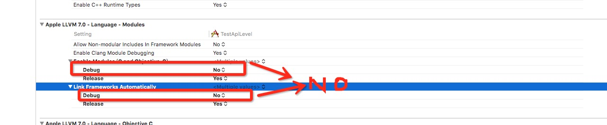

# TestApiLevel

##说明

首先必须配置pch预编译文件，然后在pch文件中引用自定义的头文件，比方在UIKit和Foundation之前引用，所以如果想要自己的项目支持的自定义的编译警告，必须将debug模式下设置 Enable Modules 和 Link Frameworks Automatically 为 NO ,具体可参考如下



自动连接的情况需要禁止，同时这时候编译可能通过不了，需要手动添加编译的库文件。
使用说明如下：

```
/**
 * Example usage:
 *   If you want to see if you're using methods that are only defined in iOS 7.0 and lower
 *   then you would use the following. Replace the __IPHONE_7_0 with whatever other macro
 *   you require. See Availability.h for iOS versions these relate to.
 *
 * YourProjectPrefixHeader.pch:
 *   #define __IPHONE_OS_VERSION_SOFT_MAX_REQUIRED __IPHONE_7_0
 *   #import "TCDefine.h"
 *
 *   // The rest of your prefix header as normal
 *   #import <UIKit/UIKit.h>
 */
 ```
宏文件参考https://github.com/mattjgalloway/MJGFoundation/blob/master/Source/Utilities/MJGAvailability.h，我只是添加了ios7之后的支持，还有有关Enable Modules 的说明可参考http://blog.csdn.net/joywii/article/details/12103327，我建议开始编译警告最好还是在debug模式下，应该使用#undef 修改系统宏可能会出现不可预知的问题。